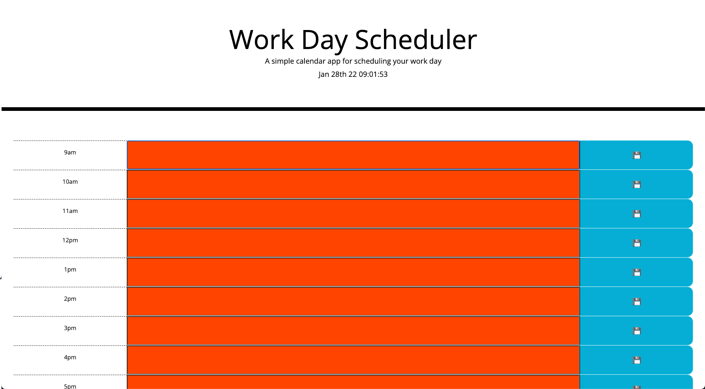

### Deployed Link
- https://bdejene19.github.io/DaysAgenda-MomentJS/ 

# Schedule Your Day with LostThoughts
## Live Demo screenshot

## About
Schedule each hour of your day to never forget a repeated task. By using Moment.js, hours of the day are tracked, updating the UI of each time block from red (past), orange (present) and green (future). User's are also able to persist their events by saving their data to local storage, meaning your events are here to stay (unless you want to update them...)!

